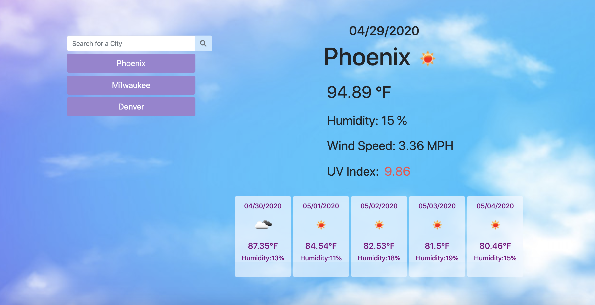

# Weather-Dashboard

## Description

I created a weather dashboard application for users to be able to look up both the current weather and the 5 day forecast for a city. When the user searches for a city that city is then added to the search history located underneath the search bar for easy access in the future to search that city again. The information the user is presented with includes the city name, date, an icon representing the weather conditions, temperature, humidity, wind speed and UV index. The UV index is color coded to represent if the conditions are favorable (green), moderate (yellow), or severe (red). Below the current weather conditions is where a 5 day forecast is displayed showing date, weather icon, temperature, and humidity.

## Table of Contents
* [Usage](#Usage)
* [Demonstration](#Demonstration)
* [Technologies](#Technologies)
* [Deployed-Link](#Deployed-Link)
* [Developer](#Developer)

## Usage

To use the Weather Dashboard application go to the [deployed link](https://meganlcoppins.github.io/Weather-Dashboard/).

## Demonstration

## Technologies 

* HTML
* CSS
* Bootstrap
* JavaScript
* Local Storage
* Third-Party API - OpenWeather API

## Deployed Link

https://meganlcoppins.github.io/Weather-Dashboard/

## Developer

Megan Coppins

https://github.com/MeganLCoppins/Weather-Dashboard